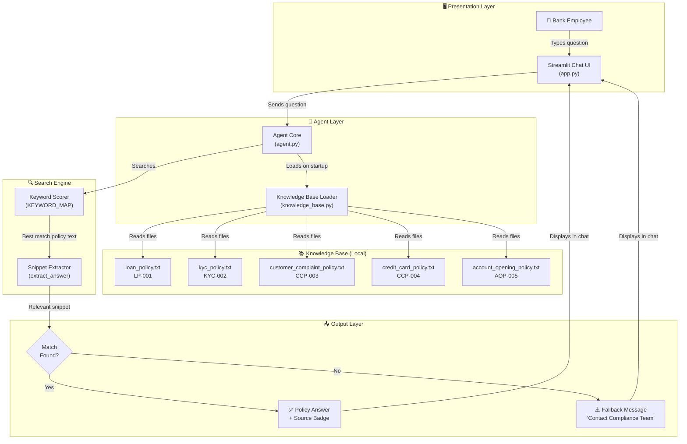

# Architecture Diagram — Internal Bank Employee Assistant

## System Architecture (Mermaid)



## Component Description

| Component | File | Responsibility |
|---|---|---|
| Streamlit Chat UI | app.py | Receives employee input, renders chat messages, displays source badge |
| Agent Core | utils/agent.py | Orchestrates search and returns structured answer |
| Knowledge Base Loader | utils/knowledge_base.py | Reads .txt policy files into memory at startup |
| Keyword Scorer | utils/knowledge_base.py | Scores each policy by keyword overlap with question |
| Snippet Extractor | utils/knowledge_base.py | Returns focused paragraph instead of full policy |
| Policy Files | policies/*.txt | Plain-text source of truth for all bank policies |

## Data Flow

```
Employee Question
      │
      ▼
Keyword Scoring (all 5 policies scored simultaneously)
      │
      ▼
Best Policy Selected (highest keyword match score)
      │
      ▼
Snippet Extraction (finds most relevant paragraph within policy)
      │
      ▼
Answer Returned to UI with Source Policy Name
```
